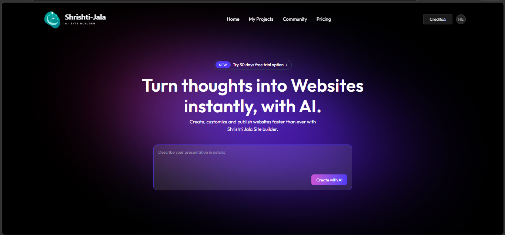
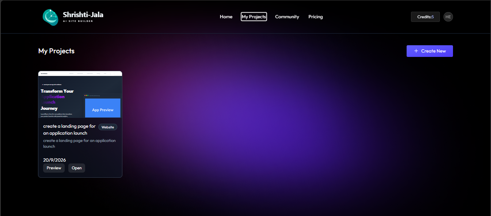
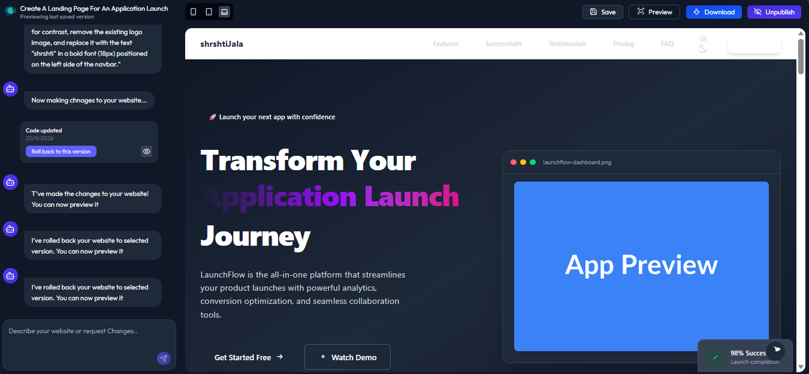
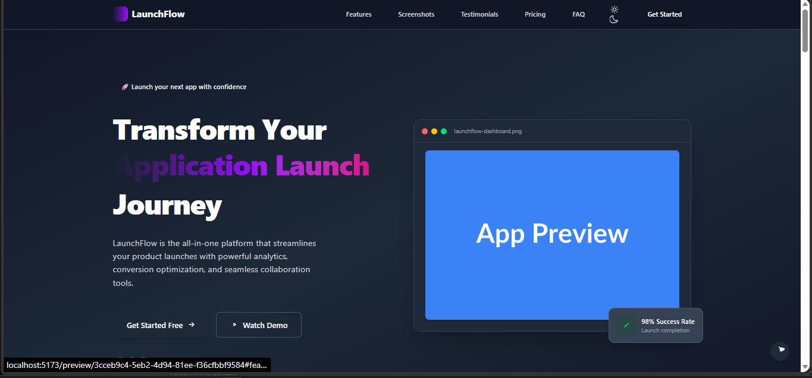
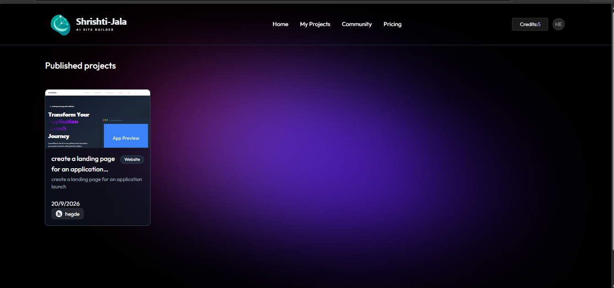
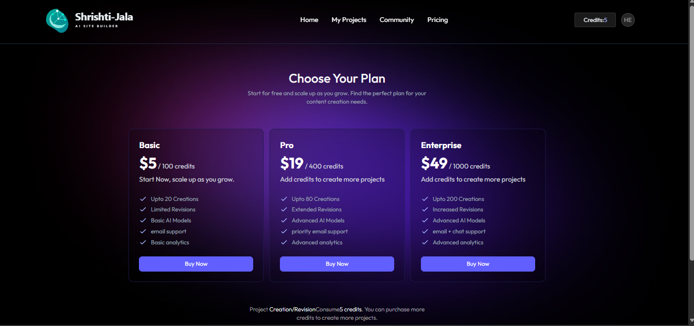

# 🌊 SrishtiJala

> **AI-Powered Website Builder** — Describe your idea, and let AI generate a complete website for you in seconds.

SrishtiJala is a full-stack AI website generation platform that lets users create, iterate, version, and publish web projects through a conversational AI interface. Built with React, Express, PostgreSQL (via Neon), Prisma, and powered by an OpenAI-compatible AI API.

---

## 📸 Screenshots

### 🏠 Home Page





---

### 📁 My Projects Dashboard





---

### ⚡ AI Project Editor




---

### 👁️ Live Preview





---

### 🌍 Community Showcase




---

### 💳 Pricing Page

<!-- Add your screenshot: docs/screenshots/pricing.png -->



---


## 🛠️ Tech Stack

| Layer       | Technology                                      |
|-------------|------------------------------------------------|
| Frontend    | React 19, TypeScript, Vite, TailwindCSS v4     |
| UI Library  | shadcn/ui, Lucide Icons, Base UI               |
| State       | TanStack Query, TanStack Store                 |
| Routing     | React Router v7                                |
| Auth        | better-auth + better-auth-ui                   |
| Backend     | Express.js v5, TypeScript, tsx                 |
| Database    | PostgreSQL (Neon) via Prisma ORM v7            |
| AI Provider | OpenAI-compatible API (via `openai` SDK)       |
| Email       | react-email                                    |

---

## ✅ Prerequisites

Make sure you have the following installed:

- **Node.js** v20 or later — [Download](https://nodejs.org/)
- **npm** v9 or later (comes with Node.js)
- A **PostgreSQL** database — [Neon](https://neon.tech/) (free tier works great)
- An **AI API Key** — OpenAI or an OpenAI-compatible provider (e.g., [OpenRouter](https://openrouter.ai/))

---

## 🚀 Getting Started

### 1. Clone the Repository

```bash
git clone https://github.com/your-username/SrishtiJala.git
cd SrishtiJala
```

---

### 2. Configure and Start the Server

```bash
cd server
```

Create a `.env` file in the `server/` directory:

```env
# App
NODE_ENV="development"

# Trusted frontend origins (comma-separated)
TRUSTED_ORIGINS="http://localhost:5173"

# PostgreSQL connection string (Neon or any Postgres provider)
DATABASE_URL="postgresql://<user>:<password>@<host>/<db>?sslmode=require"

# better-auth secret key (any random 32+ character string)
BETTER_AUTH_SECRET=your_secret_key_here

# Backend base URL
BETTER_AUTH_URL=http://localhost:3000

# AI API Key (OpenAI or OpenRouter)
AI_API_KEY="your_ai_api_key_here"

# Optional — default is 3000
PORT=3000
```

Install dependencies (Prisma client is auto-generated via `postinstall`):

```bash
npm install
```

Run database migrations:

```bash
npx prisma migrate deploy
```

Start the server:

```bash
npm run start
```

> ✅ Server running at **http://localhost:3000**

---

### 3. Configure and Start the Client

Open a **new terminal**:

```bash
cd client
```

Create a `.env` file in the `client/` directory:

```env
# Backend API base URL
VITE_BASEURL=http://localhost:3000
```

Install dependencies:

```bash
npm install
```

Start the dev server:

```bash
npm run dev
```

> ✅ Frontend running at **http://localhost:5173**

---

## 🏃 Running Both Servers Together

Open **two terminals** side by side:

```bash
# Terminal 1 — Backend
cd server && npm run start

# Terminal 2 — Frontend
cd client && npm run dev
```

---

## 🗄️ Database Schema Overview

| Model            | Description                                       |
|------------------|---------------------------------------------------|
| `User`           | Registered users with credits and creation count  |
| `WebsiteProject` | AI-generated website projects (with versioning)   |
| `Conversation`   | Chat history between user and AI per project      |
| `Version`        | Saved code snapshots of a project                 |
| `Transaction`    | Credit purchase records                           |
| `Session`        | User auth sessions (managed by better-auth)       |
| `Account`        | OAuth provider accounts                           |
| `Verification`   | Email verification tokens                         |


## 🔑 Environment Variables Reference

### `server/.env`

| Variable             | Required | Description                                      |
|----------------------|----------|--------------------------------------------------|
| `NODE_ENV`           | ✅       | `development` or `production`                    |
| `TRUSTED_ORIGINS`    | ✅       | Comma-separated list of allowed frontend origins |
| `DATABASE_URL`       | ✅       | PostgreSQL connection string                     |
| `BETTER_AUTH_SECRET` | ✅       | Random secret for session signing (min 32 chars) |
| `BETTER_AUTH_URL`    | ✅       | Backend base URL                                 |
| `AI_API_KEY`         | ✅       | API key for OpenAI or compatible provider        |
| `PORT`               | ❌       | Port for Express server (default: `3000`)        |

### `client/.env`

| Variable        | Required | Description          |
|-----------------|----------|----------------------|
| `VITE_BASEURL`  | ✅       | Backend API base URL |

---

## 🤝 Contributing

1. Fork the repository
2. Create a feature branch: `git checkout -b feature/your-feature`
3. Commit your changes: `git commit -m 'feat: add your feature'`
4. Push to the branch: `git push origin feature/your-feature`
5. Open a Pull Request

---

## 📄 License

This project is licensed under the **MIT License**. See [LICENSE](LICENSE) for details.

---

##  Acknowledgements

- [better-auth](https://better-auth.com/) — Authentication
- [Prisma](https://prisma.io/) — Database ORM
- [Neon](https://neon.tech/) — Serverless PostgreSQL
- [TanStack](https://tanstack.com/) — Query, Store, Form, Table
- [shadcn/ui](https://ui.shadcn.com/) — UI Components
- [OpenRouter](https://openrouter.ai/) / [OpenAI](https://openai.com/) — AI backbone
